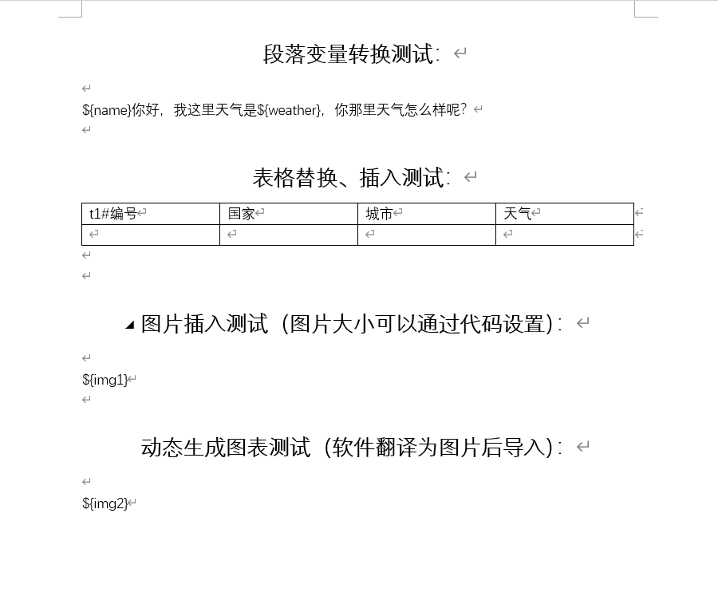
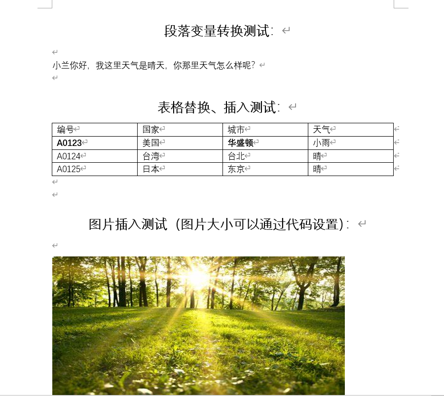
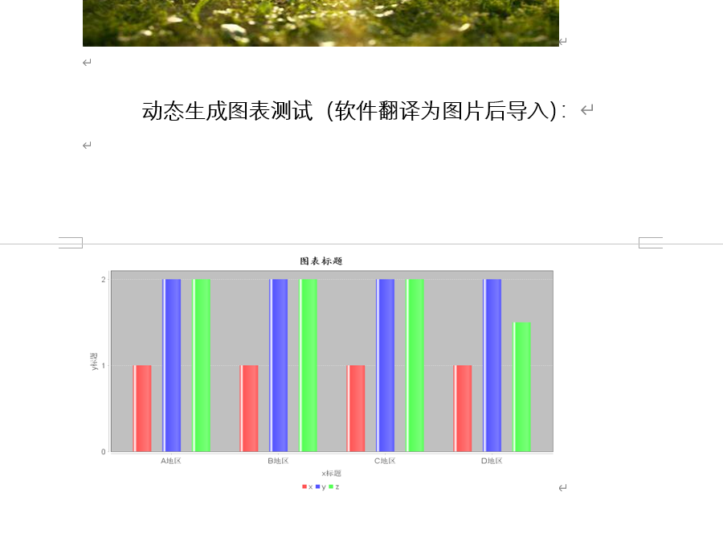

# 使用指南

**el4word**能够读取模板`word`文件，并对其中的标识进行识别和替换，最终生成完整的`word`。它适合周期性的生成同类型`word`报告的情况，将繁琐的操作交由程序动态生成，减少人力成本。

- [x] 支持文字转换
- [x] 支持图片替换
- [x] 支持表格插入与替换
- [x] 内置二维图表报告，可另做拓展
- [x] 替换时保留原格式，生成的报告样式不受限
- [x] EL表达式风格，使用门槛低
- [x] 扩展性支持，例如读写`word`如有需要，在自定义后，甚至可以远程读取、加密等

### 使用效果展示：

**转换前的样子：**

模板文件：`poi_template.docx`



**转换后的效果：**

表格的插入功能由于无法读取原格式，这里支持代码形式的简单格式定义，比如下面的第一行编号和华盛顿都是代码指定需要加粗





### 使用

```java
Word word = Office.getWordHandler();
//读取模板文件
word.addSource(new FileSource("D:\\poi\\poi_template.docx")); //must be the first step
//添加配置，文字、图片、表格等都需要在这里配置
word.addConfig(new MyConfig());
//转换段落(若不需要则省略)
word.transformParagraphs();
//转换表格(若不需要则省略)
word.transformTables();
//转换图片(若不需要则省略)
word.transformPictures();
//将转换好的文件输出
word.addSink(new FileSink("D:\\poi\\poi_out.docx"));
word.save();    //must be the final step
System.out.println("transform success!");
```

**模板文件：**需要在模板文件中定义好要替换的变量和样式

`word`中可能会分块保存而用户不知情，这是`word`本身采用的存储方式，由于此特性，所以使用时需要注意一些问题，对于本程序而言，读取时跨分块是不会认为它是一个整体的，变量的读取必须保证在同一个分块内，不然会无法识别，为了避免这种问题，在输入变量时，建议先在文本文件中输入，然后一次粘贴进`word`，这样变量会保存在一个块中，程序就可以正常识别替换。粘贴后的内容，可以改变其显示样式，不会导致块分开（但是变量的样式应该一样）。

举例，假如模板文件中的内容是：`${name}，你好`

`${name}`就需要在`txt`文本中输入后，整体粘贴进`word`中，其他非变量内容随意。

然后可以对变量设置样式，比如加粗**${name}**，但是变量的样式必须一致，不能分开，**${na**me}，这样只设置一半是不行，如果有需要的话，请按照样式设置两个变量，每个变量的样式需要一致，不然无法识别和替换。

对于这样的模板内容：**${name}**，你好。替换后会是：**小兰**，你好。

也就是说，变量的样式会在最终得到保留，用户可依据此特性设置一个漂亮的模板和目标`word`文件

**读取模板文件：**

实例代码中添加模板文件到程序的方式是通过：

```java
/**
 * 添加读取文件的方式
 *
 * @param source 可自定义，或者是{@link FileSource}
 */
void addSource(Source source);
```

需要实现`com.github.hongshuboy.office.Source`，默认有一个本地文件的实现`com.github.hongshuboy.office.impl.FileSource`，若有其他需要可以自定义。

添加输出也是一样，有默认的本地文件形式输出，也可以自定义

```java
/**
 * 添加存储文件的方式
 *
 * @param sink 可自定义，或使用{@link FileSink}
 */
void addSink(Sink sink);
```

配置Config规则，这里是变量转换的关键

```java
/**
 * 添加替换规则或表格插入等数据
 *
 * @param config 需要自定义，可灵活选择加载方式，如实现一个JDBCConfig
 */
void addConfig(Config config);
```


