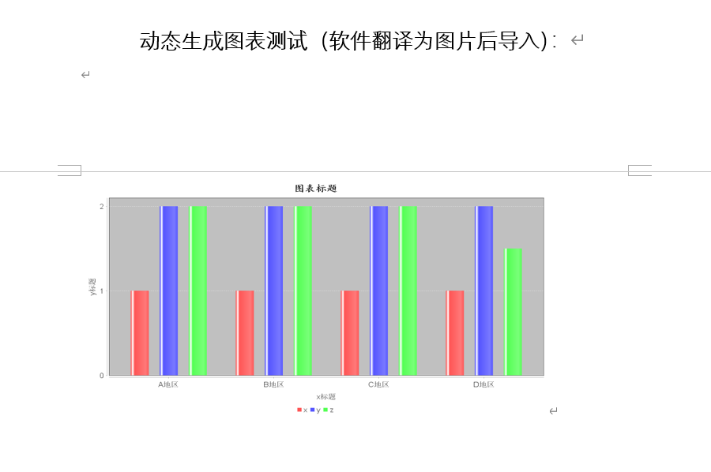

# 使用指南

**el4word**能够读取模板`word`文件，并对其中的标识进行识别和替换，最终生成完整的`word`。它适合周期性的生成同类型`word`报告的情况，将繁琐的操作交由程序动态生成，减少人力成本。

| License                                        | Code Beat                                                    | Language                                                     | Build                                                        | Size                                                         | Contributors                                                 |
| ---------------------------------------------- | ------------------------------------------------------------ | ------------------------------------------------------------ | ------------------------------------------------------------ | ------------------------------------------------------------ | ------------------------------------------------------------ |
|  | [](https://codebeat.co/projects/github-com-hongshuboy-el4word-master) |  |  |  |  |


- [x] 支持文字转换
- [x] 支持图片替换
- [x] 支持表格插入与替换
- [x] 内置二维图表报告，可另做拓展
- [x] 替换时保留原格式，生成的报告样式不受限
- [x] EL表达式风格，使用门槛低
- [x] 扩展性支持，例如读写`word`如有需要，在自定义后，甚至可以远程读取、加密等

## 效果展示：

**转换前的样子：**

模板文件：`poi_template.docx`


**转换后的效果：**

表格的插入功能由于无法读取原格式，这里支持代码形式的简单格式定义，比如下面的第一行编号和华盛顿都是代码指定需要加粗




## 使用方式

*可以参考源码`test`目录下的示例，测试代码使用到的资源文件在`test/java/resources`下*

```java
Word word = Office.getWordHandler();
//读取模板文件
word.addSource(new FileSource("D:\\poi\\poi_template.docx")); //must be the first step
//添加配置，文字、图片、表格等都需要在这里配置
word.addConfig(new MyConfig());
//转换段落(若不需要则省略)
word.transformParagraphs();
//转换表格(若不需要则省略)
word.transformTables();
//转换图片(若不需要则省略)
word.transformPictures();
//将转换好的文件输出
word.addSink(new FileSink("D:\\poi\\poi_out.docx"));
word.save();    //must be the final step
System.out.println("transform success!");
```

**模板文件：**需要在模板文件中定义好要替换的变量和样式

`word`中可能会分块保存而用户不知情，这是`word`本身采用的存储方式，由于此特性，所以使用时需要注意一些问题，对于本程序而言，读取时跨分块是不会认为它是一个整体的，变量的读取必须保证在同一个分块内，不然会无法识别，为了避免这种问题，在输入变量时，建议先在文本文件中输入，然后一次粘贴进`word`，这样变量会保存在一个块中，程序就可以正常识别替换。粘贴后的内容，可以改变其显示样式，不会导致块分开（但是变量的样式应该一样）。

举例，假如模板文件中的内容是：`${name}，你好`

`${name}`就需要在`txt`文本中输入后，整体粘贴进`word`中，其他非变量内容随意。

然后可以对变量设置样式，比如加粗**${name}**，但是变量的样式必须一致，不能分开，**${na**me}，这样只设置一半是不行，如果有需要的话，请按照样式设置两个变量，每个变量的样式需要一致，不然无法识别和替换。

对于这样的模板内容：**${name}**，你好。替换后会是：**小兰**，你好。

也就是说，变量的样式会在最终得到保留，用户可依据此特性设置一个漂亮的模板和目标`word`文件

**Source 读取模板文件：**

实例代码中添加模板文件到程序的方式是通过：

```java
/**
 * 添加读取文件的方式
 *
 * @param source 可自定义，或者是{@link FileSource}
 */
void addSource(Source source);
```

**Sink 输出转换后的Word**

需要实现`com.github.hongshuboy.office.Source`，默认有一个本地文件的实现`com.github.hongshuboy.office.impl.FileSource`，若有其他需要可以自定义。

添加输出也是一样，有默认的本地文件形式输出，也可以自定义

```java
/**
 * 添加存储文件的方式
 *
 * @param sink 可自定义，或使用{@link FileSink}
 */
void addSink(Sink sink);
```

**Config 配置变量**

配置`Config`规则，这里是变量转换的关键

```java
/**
 * 添加替换规则或表格插入等数据
 *
 * @param config 需要自定义，可灵活选择加载方式，如实现一个JDBCConfig
 */
void addConfig(Config config);
```

`Config`没有默认实现，使用时需要实现`com.github.hongshuboy.office.Config`接口

```java
/**
 * 配置类，对Word的变量定义都在这里
 * 实现该接口后，可以实现多种配置源的接入，如实现一个JDBCConfig，可从数据库读取配置
 */
public interface Config {
    /**
     * 获取EL的配置
     */
    default Map<String, String> getElMap(){
        return Collections.emptyMap();
    }

    /**
     * <p>表格插入的数据，Key是表格名，需要在表头的第一列设置 tableName#column
     * 之后工具会用tableName作为Key，对该map取值</p>
     * <p>map的Value是List集合，拿到该集合后，在word中对相应的表格进行插入</p>
     * <p>List中的元素类型是String数组，每一个数组中的元素对应一个word表格中的单元格，
     * 如果使用#b标记的，会被工具解析并且生成为加粗字体，如#b:A0123</p>
     */
    default Map<String, List<String[]>> getTableData(){
        return Collections.emptyMap();
    }

    /**
     * 设置准备插入的图片
     */
    default Map<String, WordPicture> getPictures(){
        return Collections.emptyMap();
    }
}
```

- `getElMap`为EL表达式的转换规则
- `getTableData`为表格的转换规则，如果表格中使用EL表达式如`${name}`，将执行替换模式，使用`ELMap`的转换规则，如果表格中不存在`${xx}`，将执行插入模式，对匹配到的表名进行插入。返回值`key`为表名，`value`为带插入的表格内容。插入模式时，表格第一个单元格必须匹配`table-name#xxx`的格式（请参考最开始的演示截图），`#`之前的为表格名，如下`t1`和`t2`是表格名，用于标识匹配的表格。
- `getPictures`图片的转换规则，同样使用`EL`表达式，匹配到后使用图片文件替换，所以这里的`EL`变量应该唯一，不能和段落的变量重复。

```java
public class MyConfig implements Config {
    @Override
    public Map<String, String> getElMap() {
        Map<String, String> elMap = new HashMap<>();
        elMap.put("name", "小兰");
        elMap.put("weather", "晴天");
        return elMap;
    }

    @Override
    public Map<String, List<String[]>> getTableData() {
        ArrayList<String[]> list = new ArrayList<>();
        list.add(new String[]{"#b:A0123", "美国", "#b:华盛顿", "小雨"});
        list.add(new String[]{"A0124", "台湾", "台北", "晴"});
        list.add(new String[]{"A0125", "日本", "东京", "晴"});
        Map<String, List<String[]>> tableData = new HashMap<>();
        tableData.put("t1", list);//表格1
        ArrayList<String[]> list2 = new ArrayList<>();
        list2.add(new String[]{"1", "2", "3", "4", "5", "#b:6"});
        list2.add(new String[]{"#b:11", "22", "33", "44", "55", "#b:66"});
        tableData.put("t2", list2);//表格2
        return tableData;
    }

    @Override
    public Map<String, WordPicture> getPictures() {
        Map<String, WordPicture> map = new HashMap<>();
        try {
            map.put("img1", WordPicture.of(new FileInputStream("D:\\poi\\spring.jpg"), "flink", 474, 237, PictureType.PICTURE_TYPE_JPEG));
        } catch (Exception e) {
            e.printStackTrace();
        }
        return map;
    }
}
```

**文章开头的示例图片中，最下面的图标是如何生成的**

实际上这里是生成了一个表格的图片，然后对图片进行插入，所以需要的话，配置应该在`getPictures`内。因为`WordPicture`只需要图片的输入流，所以使用其他方式生成图表同样支持，可以灵活扩展。

```java
@Override
public Map<String, WordPicture> getPictures() {
    Map<String, WordPicture> map = new HashMap<>();
    try {
        map.put("img1", WordPicture.of(new FileInputStream("D:\\poi\\spring.jpg"), "flink", 474, 237, PictureType.PICTURE_TYPE_JPEG));
        //生成图表
        ByteArrayInputStream inputStream = loadOneChart();
        //图片变量替换
        map.put("img2", WordPicture.of(inputStream, "", 474, 237, PictureType.PICTURE_TYPE_JPEG));
    } catch (Exception e) {
        e.printStackTrace();
    }
    return map;
}

private ByteArrayInputStream loadOneChart() throws Exception {
    BarChart chart = new BarChart();
    DefaultCategoryDataset dataset = new DefaultCategoryDataset();
    dataset.addValue(1, "x", "A地区");
    dataset.addValue(2, "y", "A地区");
    dataset.addValue(2, "z", "A地区");


    dataset.addValue(1, "x", "B地区");
    dataset.addValue(2, "y", "B地区");
    dataset.addValue(2, "z", "B地区");


    dataset.addValue(1, "x", "C地区");
    dataset.addValue(2, "y", "C地区");
    dataset.addValue(2, "z", "C地区");


    dataset.addValue(1, "x", "D地区");
    dataset.addValue(2, "y", "D地区");
    dataset.addValue(1.5, "z", "D地区");

    return chart.makeBarChart(dataset, "图表标题", "x标题", "y标题");
}
```

## 作者 Author

弘树丶

> wangpeng(hongshu)

Email:hongshuboy@gmail.com

## 版权说明 License 

本项目使用**Apache License 2.0**授权许可，详情请参阅 ***\LICENSE*** 和 ***\NOTICE***

*hongshuboy/el4word is licensed under the Apache License 2.0,please read LICENSE and NOTICE for more information*

Copyright ©2020 wangpeng(hongshu)

